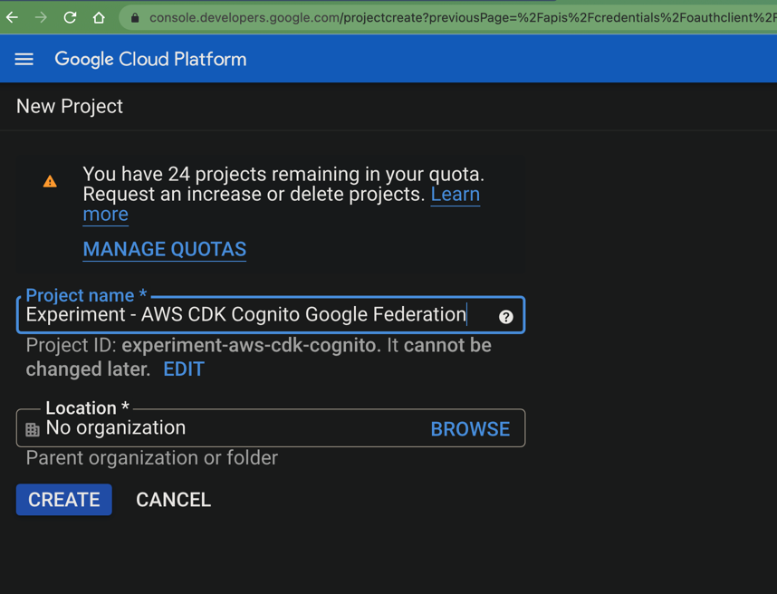
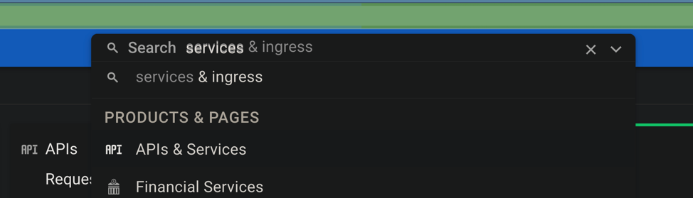
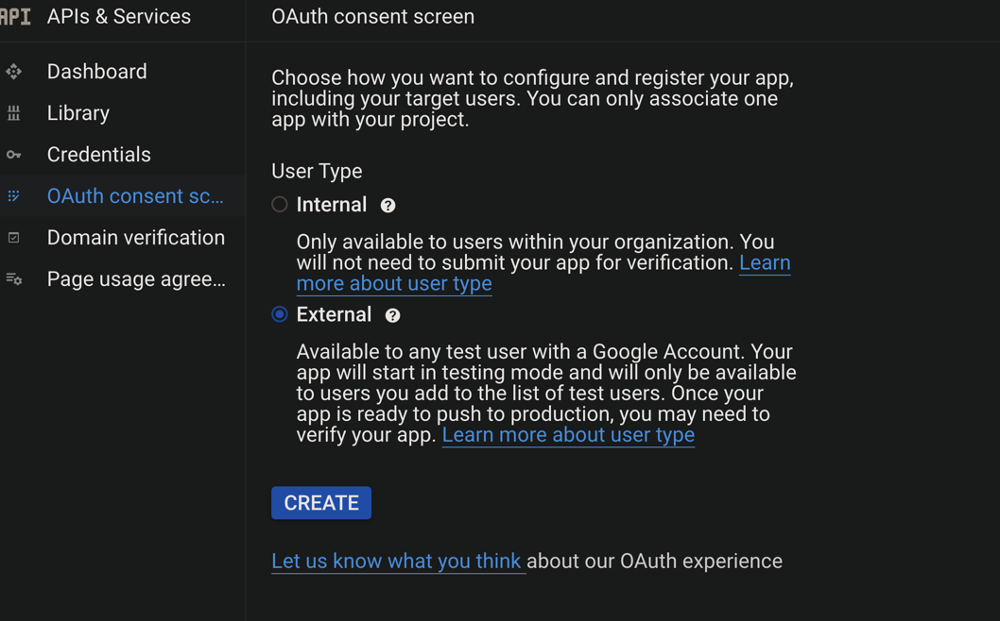

### Getting started

Before starting, take note of the following details and have them easily accessible:

* AWS_REGION (e.g. us-east-1) - The AWS account where you plan to deploy your infrastructure, e.g. your Cognito User
  Pool
* UNIQUE_PREFIX - A globally unique prefix for your infrastructure. At this point, just make something up, like "
  acme-company-2022". This is mainly used to prefix the Cognito Hosted UI domain name, and Cognito enforces a rule that
  no two customers can have the same prefix (just like S3 bucket names for example).

Take note of these. We'll be referring to them in the subsequent steps.

Let's continue by creating a new project in the Google Cloud Console.



Search for "APIs & Services" and click on OAuth Consent Screen in the left sidebar. Choose "External" for "User type".




Fill in the required fields.

IMPORTANT! For "Authorized domains", enter `amazoncognito.com`.

Click on "Credentials" at the left sidebar. Click on "Create credentials" at the top -> oAuth Client ID -> Application
Type=Web Application.

Remember the `UNIQUE_PREFIX` we defined at the top of this guide? Let's use it to construct the unique URL to our
Cognito Hosted UI, which is not live yet, but we'll deploy in a second.

For `Authorized redirect URIs` enter:

`https://[UNIQUE_PREFIX].auth.[AWS_REGION].amazoncognito.com/oauth2/idpresponse`

Remember to replace the variables with the values at the beginning of this guide.

For `Authorized JavaScript origins` use:

`https://[UNIQUE_PREFIX].auth.[AWS_REGION].amazoncognito.com`

The result should be two long strings, which represent your `Google Client ID` and `Google Client Secret`. Take note of
these, as you'll need them later.

Continue to deploying the CDK infrastructure, part of this project.

```
npm install
npx cdk deploy --context prefix=[UNIQUE_PREFIX] --context google-client-id=[GOOGLE_CLIENT_ID] --context google-client-secret=[GOOGLE_CLIENT_SECRET]
```
